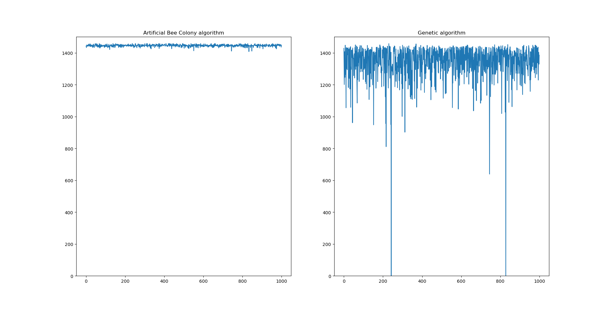

# Knapsack-problem-genetic-algo
The project presents two solutions to the knapsack problem, one using a genetic algorithm and the other using an artifical bee colony algorithm. The point of the project was comparing the performance of two nature‐inspired optimization algorithms from separate classes. 

The first algorithm used is the genetic algorithm, which takes the initial population (solutions), assigns a fitness value to each individual, selects the ones with the highest value, then creates a new population using methods such as crossover and mutation. For selection a tournament-based approach was used, crossover was halway point, and mutation was randomly adding/removing an item from the solution. 

The second algorithm used was a artificial bee colony algorithm modified to be used for the knapsack problem, based on Emrah Hancer's following article: 
An ABC Algorithm Inspired by Boolean Operators for Knapsack and Lot Sizing Problems published in the Academic Platform Journal of Engineering and Science.

The genetic algorithm proved to be faster but offered worse results than the ABC algorithm, which in turn proved to be much slower but far more accurate.
Possible improvements to be made to the genetic algorithm would be the usage of different, more advanced crossover, mutation, selection and other genetic operators. 

As the methods involve randomness, they need to be ran several times to get more accurate results, as such, I attached an image ran on the second dataset (which I got here: https://people.sc.fsu.edu/~jburkardt/datasets/knapsack_01/knapsack_01.html) where I made both methods run a thousand times each, to get more accurate results. The best possible fitness attainable for this dataset (the fitness being the sum of the items' values in the knapsack) was 1458.

Average bee fitness: 1446.004  
Required time: 169.72146701812744 s  
Average genetic fitness: 1341.933  
Required time: 7.671919584274292 s  

